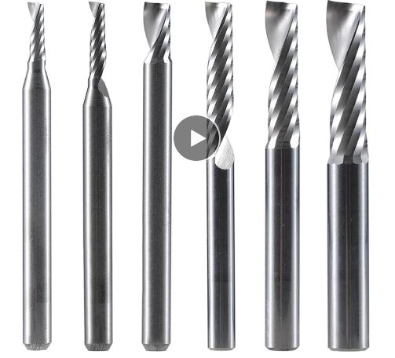
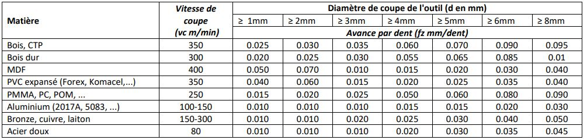
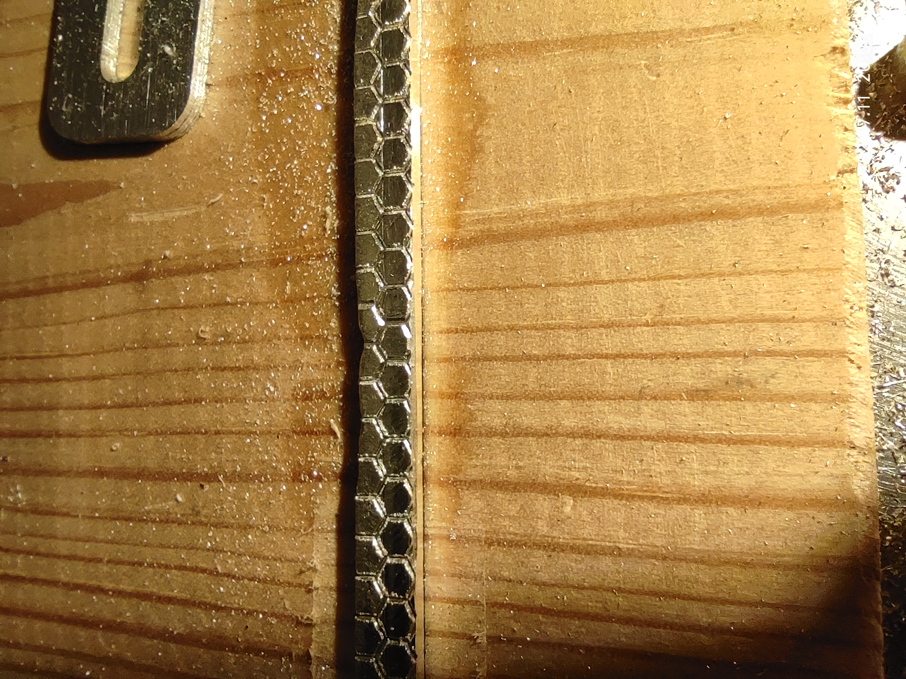

# Budget CNC cutting alluminium

This cnc router is my third itteration, the two previous versions was only able to cut wood and plastic and barely engraving aluminum.
This version is capable of cutting any soft metal (aluminuim, copper, brass even silver) easly.
The total cost including the salvaged part from my previous CNC is around 300€, if you want to replicate the project the cost can change depending of what materials you have availlable.

The design is based on 45 * 45mm aluminium extrusions that i've recovered from the waste disposal. It is powered by 4 Nema 17 stepper motors from my previous CNC and an arduino cnc shield V3.

Depending of your supplys the total cost can varry from **300 to 450€** considering you have all the required tools
From the conception to the firsts good cuts it took me around **80h** of work (mistakes includes)

The results before machining the new Z axis:

# Part list

| Part | Quantity | Cost |
|- | - | - |
| Arduino uno + CNC shield + DRV8825  | 1 | 15€ |
| M3 * 10mm screws | 100 | 4€ |
| M3 * 8mm screws| 50 | 2€ |
| Linear rail MGN12H 300mm | 4 | 60€ |
| Linear rail MGN12H 150mm | 2 | 20€ |
| Additionnal block for linear rail MGN12H | 2 | 15€ |
| T8 lead screw pitch 2mm lead 2mm 400mm with anty backlash | 1 | 10€ |
| T8 lead screw pitch 2mm lead 2mm 350mm with anty backlash | 2 | 15€ |
| T8 lead screw pitch 2mm lead 2mm 200mm with anty backlash | 1 | 5€ |
| Ball bearing KP08 | 4 | 6€ |
| Ball bearing KFL08 | 4 | 6€ |
| 3W warm white LED | 2 | 1€ |
| Nema 17 0.59N.m at least | 4 | 50€ |
| 5 * 8 aluminium coupler | 4 | 4€ |
| GT2 20 to 60 pulley kit with 200mm belt | 1 | 4€ |
| 500W spindle with controller | 1 | 80€ |
| M3 insert for plastic | 50 | 3€ |
| M4 wood insert | 50 | 2€ |
| 10mm cable sleeve | 5m | 5€ |
| 12V 150W power supply | 1 | 15€ |
| Lithium grease | 1 | 5€ |
| Total | a lot | 327€ |

In addition you need to find something to build the base on like aluminium extrusion, if you can found from second hand it can cost something like 40€ otherwise it's more like 80€. Even if it looks stiff 2020 extrusion from 3D printer can bend en vibrate with this type of machine so I'll recommand to use at least 30mm thick aluminuim extrusion.
You will also need 8mm thick aluminium plate about 200 * 200mm again if you can found some from second hand it can be really cheap.
T nut for aluminium extrusion could be added to the list (to fix the linear rails) but it's quite expensive and there isn't much load in this direction so i've 3D printed my own and add m3 inserts

Some more commun supply are also needed like heat shrink tube, solder, wires (I use wires from old RJ45 cable it can handle something like 5A without a problem, its free nd easly accessible).

A lots of tools are needed to work properly:

- Soldering iron
- Drill press
- Caliper
- Dial indicator
- Heat gun
- A good square rule
- Handed metal saw 
- Metal band saw (if your alumiun extrusions needed to be with a perfect 90° angle)
- Hand drill
- Center punch
- Marker for metal
- Hammer, clamps, screw drivers others hand tools
- 3D printer
- deburr tool

# Conception

# Cutting, drilling, tapping
 
# 3D printed parts

# Assembly

# Wirring

# Code

# Movement, origin, steps/mm

# Probe

# Lights

# Ajustements

# First cut
## Settings

At the beggining the best way to learn is to use commun settings for this type of machine, so I've used the settings from the french webbsite [CNC fraises](https://www.cncfraises.fr/cloud/ParametresDeCoupe_CncFraises_V1.6.pdf)
Google translate can be really useful, otherwise here is a quick recap:

The easiest software to begin is fusion 360 even if you are using solidworks or something else teh toolpath generation is easy to understand with a good definition for eatch settings.

First of all you need to choose what tool to use to cut the path. For a hobby CNC a verry versatile tool is a 1 tooth 2 or 3mm cutter like this one.

This is the standard version but there is a large variety of surface treatment like TiN or DLC, the standard version is ok to begin with because it's cheap so it isn't that bad if one gets broke but the DLC treatment seems to add longevity and will have a higher cutting speed.

So once you have your tool you need to know his cutting speed in m/min, it represents the maximum tangantial speed. Most of the cutter like the one above is rated for something like 100-150m/min (depending of the matirial) you can go higher but it can reduce the tool's lifetime.
Once you know the cutting speed and the diamater of the tool you can calculate the spindle speed.

For a 3mm tool: `(1000*120)/(3*pi) = 12700rpm`

Then choose the closest value your speedle can achieve 12000 for me

The next step is to choose the appropriate feedrate as you can see on the chart bellow an advance per turn of 0.01mm/turn is good for aluminium for a 3mm tool. 
In my opinion you can go higher as long as the noise is smooth (I use 0.015 in general for aluminium).
All the different cutting speed for different materials are also listed in this chart.

Once you have theeses settings you just need to enter the values in fusion 360 and it will set the appropriate feedrate.
Depending of the material it can set it to a value that the machine can't achieve (500mm/min max for me) if so, just decrease the speed of the spindle to match the value.

**The most important thing to consider is the advance per turn if you go too fast it can break the tool or twist the machine, if you go too slow the tool will rub on the material without cutting so eather the tool broke or the material met or catch fire**

## Tool path

# Results
## Wood
## Aluminium

Here is the Z axis (replacment for the 3D printed parts) and 8 holder which I use to constrain my parts when machining

Here is a 100mm turbine I've machined for another project it took a while, 15h for 15mm deeph on one side 3mm on the other the part wasn't enougth constrained so the blades aren't perfect but it's good enought for me.

## Copper

This is a small support I design to handle small PT1000 thermal sensors for cryogenic applications, copper is often the best option with really low temperatures.
As for the previous results I've followed the charts above 

## Silver

This is result is from my second attend of engraving a metal (first one was on brass with my previous cnc)
Engraving metal is a little bit tricky because the tool can broke in an instant.
You need to go slowly with small deeph, for this result the advance was at 100mm/min and deepth at 0.05mm.
Silver is verry soft so it can stick to the cutting tool so make sure tu lubricate while cutting (water is ok for silver)

## Brass

# Microlubrification
